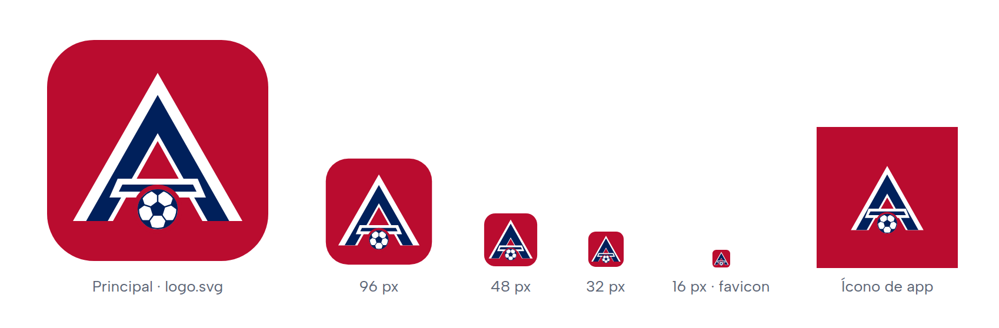
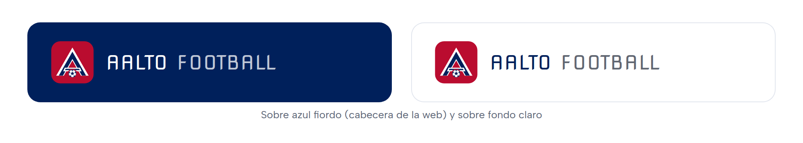
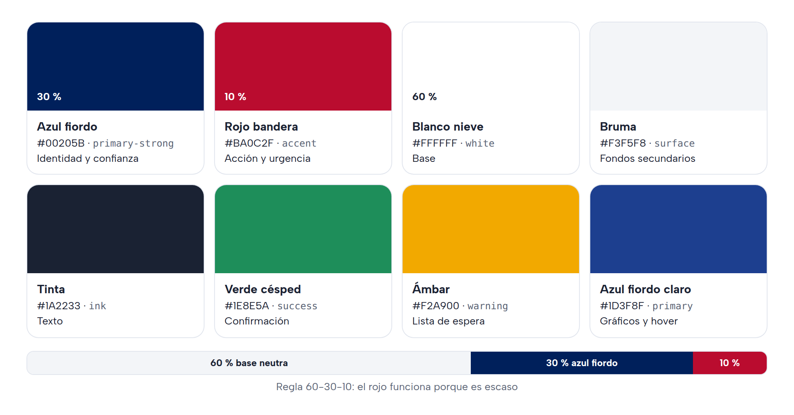
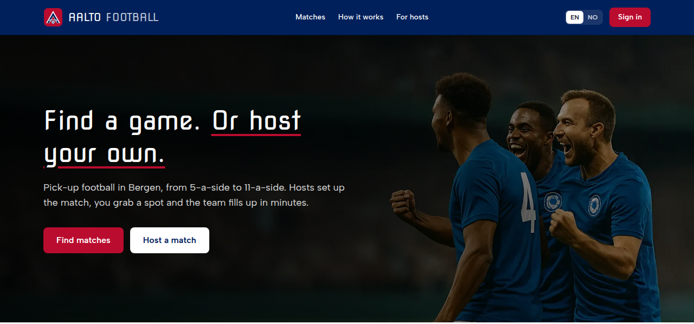
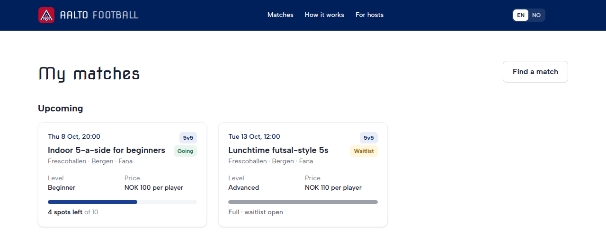

# Aalto Football: guía de marca

Fútbol para todos en Bergen. La marca tiene que hacer tres cosas: **dar confianza** (vas a jugar con desconocidos y te comprometés a ir), **empujar a la acción** (apuntarse tiene que ser lo más fácil de la pantalla) y **sentirse de acá** (Noruega, Bergen, su fútbol).

## 1. Logo: Fjell-A

**La idea.** La **A** de Aalto es una **montaña** (*fjell*): Bergen es "la ciudad entre las siete montañas" y Noruega es montaña y fiordo. La A se dibuja como la **cruz de la bandera noruega**, blanca por fuera y azul por dentro, y el **balón** está en la base, donde se juega. Es noruega sin copiar la bandera, y es fútbol sin necesitar texto.

**Por qué un ícono rojo.** Las pantallas de inicio están llenas de íconos azules (Messenger, Facebook, LinkedIn, Playtomic). Un ícono rojo se encuentra al instante. En Bergen, además, el rojo ya es fútbol: es el color del SK Brann.

**Versiones** (en `apps/web/public/brand/`):

| Archivo | Uso |
|---|---|
| `logo.svg` | Versión principal: cabecera de la web, emails, documentos (de 32 px en adelante) |
| `logo-small.svg` | Favicon y tamaños de 16 a 32 px: líneas más gruesas y balón más grande para que se lea |
| `logo-maskable.svg` | Ícono de Android e iPhone: rojo a sangre, y el sistema recorta la forma |
| `logo-512.png` | Para redes sociales o donde no se pueda usar SVG |

**Cómo usarlo**

- Junto al nombre: el logo a la izquierda y **AALTO FOOTBALL** en *Nova Square*. Sobre fondo azul, "AALTO" en blanco y "FOOTBALL" en blanco al 75 %; sobre fondo claro, "AALTO" en azul fiordo y "FOOTBALL" en tinta al 70 %.
- Espacio libre alrededor: como mínimo, el ancho del balón.
- Tamaño mínimo: 16 px, siempre con `logo-small.svg`.
- No hacer: cambiarle los colores, rotarlo, ponerle sombras o contornos, ni apoyarlo sobre fondos rojos (se pierde el borde).

## 2. Paleta de colores

**Regla 60-30-10:** 60 % de base neutra, 30 % de azul de marca y 10 % de rojo de acción. El rojo funciona porque es escaso: si todo es rojo, nada destaca.

| Color | Hex | Token | Para qué | Efecto en el usuario |
|---|---|---|---|---|
| Blanco nieve | `#FFFFFF` | `white` | Fondos principales | Calma, orden, diseño escandinavo |
| Bruma | `#F3F5F8` | `surface` | Tarjetas y fondos secundarios | Separa sin ruido (un guiño a la niebla de Bergen) |
| **Azul fiordo** | `#00205B` | `primary-strong` | Cabecera, títulos, enlaces, etiquetas | **Confianza**, seriedad, Noruega (el azul de la bandera) |
| Azul fiordo claro | `#1D3F8F` | `primary` | Barras, gráficos, estados hover | Lo mismo, en superficies más grandes |
| Azul hielo | `#E8EDF7` | `primary-soft` | Chips y fondos de información | Destaca sin gritar |
| **Rojo bandera** | `#BA0C2F` | `accent` | Botones de acción ("Join", "Host"), plazas que se acaban, errores | **Urgencia y decisión**: es lo que más se clickea |
| Rojo oscuro | `#9E0A27` | `accent-strong` | Hover de botones, textos de error | |
| Rojo suave | `#FBE9EC` | `accent-soft` | Fondo de avisos de error | |
| Verde césped | `#1E8E5A` | `success` | "You're in!", confirmados | **Logro y pertenencia**; además, es la cancha |
| Ámbar | `#F2A900` | `warning` | Lista de espera, avisos | Atención sin alarma |
| Tinta | `#1A2233` | `ink` | Texto | Más cálido que el negro; combina con el azul |

**Por qué esta paleta**
- **El azul da confianza.** Es el color de las plataformas donde uno se compromete con desconocidos (bancos, Playtomic). En la base de la web reduce la sensación de riesgo de apuntarse a un partido con gente que no conocés.
- **El rojo, solo para actuar.** El rojo sube la urgencia: en un botón o en "quedan 2 plazas" empuja a decidir. En toda la pantalla cansa y transmite alarma. Lo que es distinto es lo que se ve y se recuerda (efecto Von Restorff), así que reservarlo hace que el botón "Join" sea lo primero que mira el ojo.
- **Identidad local.** El azul y el rojo son los de la bandera noruega, y el rojo además es el de Brann. Para alguien de Bergen, la marca se siente propia.
- **Accesible.** Blanco sobre rojo bandera da alrededor de 6:1 y azul fiordo sobre blanco más de 15:1. Las dos combinaciones superan la norma WCAG AA.

**Reglas**
- Los botones de acción principales van en rojo, uno por zona de pantalla. Los secundarios, en blanco con borde.
- El rojo también marca errores. Por eso los errores siempre llevan **ícono y texto**: nunca se comunica algo solo con color.
- Estados de un partido: confirmado en **verde**, lista de espera en **ámbar**, organizador en **azul**, cancelado en **rojo**.
- No usar el azul eléctrico ni el naranja anteriores (`#2979FF`, `#FF6D00`).

**Así se ve en la web**

## 3. Tipografía

- **Nova Square**: logo y títulos grandes (H1). Geométrica y deportiva; solo en momentos de marca.
- **Albert Sans**: todo lo demás (texto, botones, formularios, navegación). Clara y muy legible.

## 4. Tono e imágenes

- **Tono:** cercano, directo y en positivo ("You're in! See you on the pitch."). Inglés y noruego bokmål.
- **Imágenes:** jugadores amateurs reales y diversos, canchas de barrio, momentos de juego y de celebración. Mejor luz natural o focos de cancha nocturna, que es como se juega en Bergen.
- **Íconos:** de línea simple (estilo Lucide o Heroicons).

## 5. Dónde vive cada cosa en el código

| Qué | Dónde |
|---|---|
| Colores (tokens) | `apps/web/src/app/globals.css` (`@theme`) |
| Logo en la web | `apps/web/src/components/Logo.tsx` y `apps/web/public/brand/` |
| Favicon e íconos de la app | `apps/web/src/app/icon.svg`, `apple-icon.png`, `apps/web/public/icons/` |
| Color de la barra del navegador | `BRAND_BLUE` en `apps/web/src/lib/site.ts` |
| Emails | `apps/web/src/lib/email.ts` y `supabase/templates/` |
